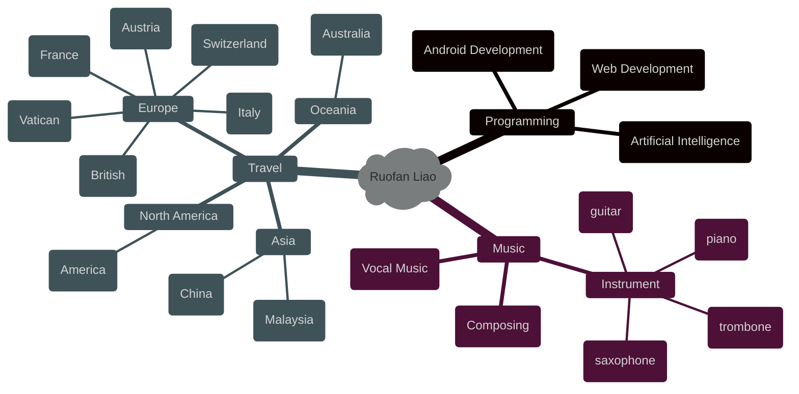

### Hi there 👋

<!--
**LLLLLrf/LLLLLrf** is a ✨ _special_ ✨ repository because its `README.md` (this file) appears on your GitHub profile.

Here are some ideas to get you started:

- 🔭 I’m currently working on ...
- 🌱 I’m currently learning ...
- 👯 I’m looking to collaborate on ...
- 🤔 I’m looking for help with ...
- 💬 Ask me about ...
- 📫 How to reach me: ...
- 😄 Pronouns: ...
- ⚡ Fun fact: ...
-->

<!-- dynamic typing effect 动态打字效果 -->

    

<!--  typing gif  -->
 

     
 

 

  

 
  <h3> visitors </h3>
  

    

        

    <h3>My Repositories</h3>
    
    
    
    

<h3 align="center">About Me</h3>

