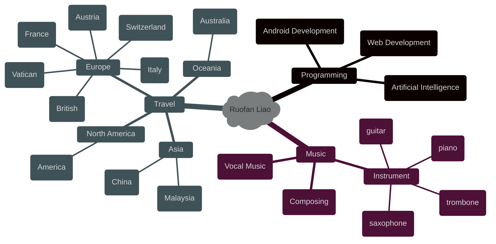

### Hi there 👋

<!--
**LLLLLrf/LLLLLrf** is a ✨ _special_ ✨ repository because its `README.md` (this file) appears on your GitHub profile.

Here are some ideas to get you started:

- 🔭 I’m currently working on ...
- 🌱 I’m currently learning ...
- 👯 I’m looking to collaborate on ...
- 🤔 I’m looking for help with ...
- 💬 Ask me about ...
- 📫 How to reach me: ...
- 😄 Pronouns: ...
- ⚡ Fun fact: ...
-->
 <div align="center">
  <h1>  Visitors
    </h1>
</div>
<!-- dynamic typing effect 动态打字效果 -->
<div align="center">
    <a href="https://github.com/LLLLLrf">
      
    </a>
</div>
<!--  typing gif  -->
 <div align="center">
    <br>
 </div>
 
<div align="center">
  
[](https://www.python.org/)


[](https://git-scm.com/)

</br>


  
  

</div>


<div align="center">

  
</br>

[](https://github.com/LLLLLrf/github-readme-stats)
[](https://github.com/anuraghazra/github-readme-stats)

</div>

<!--START_SECTION:waka-->


**🐱 My GitHub Data** 

> 📦 ? Used in GitHub's Storage 
 > 
> 🏆 112 Contributions in the Year 2024
 > 
> 🚫 Not Opted to Hire
 > 
> 📜 18 Public Repositories 
 > 
> 🔑 0 Private Repositories 
 > 
**I'm a Night 🦉** 

```text
🌞 Morning                165 commits         ████░░░░░░░░░░░░░░░░░░░░░   14.25 % 
🌆 Daytime                387 commits         ████████░░░░░░░░░░░░░░░░░   33.42 % 
🌃 Evening                285 commits         ██████░░░░░░░░░░░░░░░░░░░   24.61 % 
🌙 Night                  321 commits         ███████░░░░░░░░░░░░░░░░░░   27.72 % 
```
📅 **I'm Most Productive on Wednesday** 

```text
Monday                   237 commits         █████░░░░░░░░░░░░░░░░░░░░   20.47 % 
Tuesday                  191 commits         ████░░░░░░░░░░░░░░░░░░░░░   16.49 % 
Wednesday                248 commits         █████░░░░░░░░░░░░░░░░░░░░   21.42 % 
Thursday                 168 commits         ████░░░░░░░░░░░░░░░░░░░░░   14.51 % 
Friday                   191 commits         ████░░░░░░░░░░░░░░░░░░░░░   16.49 % 
Saturday                 65 commits          █░░░░░░░░░░░░░░░░░░░░░░░░   05.61 % 
Sunday                   58 commits          █░░░░░░░░░░░░░░░░░░░░░░░░   05.01 % 
```


📊 **This Week I Spent My Time On** 

```text
🕑︎ Time Zone: Asia/Shanghai

💬 Programming Languages: 
No Activity Tracked This Week

🔥 Editors: 
No Activity Tracked This Week

🐱‍💻 Projects: 
No Activity Tracked This Week

💻 Operating System: 
No Activity Tracked This Week
```

**I Mostly Code in Python** 

```text
Python                   11 repos            ███████████░░░░░░░░░░░░░░   42.31 % 
JavaScript               3 repos             ███░░░░░░░░░░░░░░░░░░░░░░   11.54 % 
Java                     3 repos             ███░░░░░░░░░░░░░░░░░░░░░░   11.54 % 
HTML                     2 repos             ██░░░░░░░░░░░░░░░░░░░░░░░   07.69 % 
Dart                     1 repo              █░░░░░░░░░░░░░░░░░░░░░░░░   03.85 % 
```


 Last Updated on 09/10/2024 08:23:56 UTC
<!--END_SECTION:waka-->


<div align="center">
    <h3>My Repositories</h3>
    <a href="https://github.com/LLLLLrf/BodyBuddy">
    </a>
    <a href="https://github.com/LLLLLrf/WearWizard">
    </a>
    <a href="https://github.com/LLLLLrf/GPA-Calculate">
    </a>
    <a href="https://github.com/LLLLLrf/Web-Develop-Assignment">
    </a>
    <a href="https://github.com/LLLLLrf/JavaAssignment">
    </a>
    <a href="https://github.com/LLLLLrf/CafeManagement">
    </a>
    <a href="https://github.com/LLLLLrf/Data-Structure-Subway-Map">
    </a>
    <a href="https://github.com/LLLLLrf/ros2_ws">
    </a>
</div>

<h3 align="center">About Me</h3>


