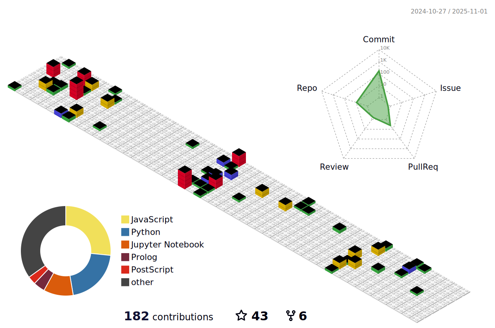

### Hi there 👋

 <div align="center">
    <br>
 </div>

 

<!--
**LLLLLrf/LLLLLrf** is a ✨ _special_ ✨ repository because its `README.md` (this file) appears on your GitHub profile.

Here are some ideas to get you started:

- 🔭 I’m currently working on ...
- 🌱 I’m currently learning ...
- 👯 I’m looking to collaborate on ...
- 🤔 I’m looking for help with ...
- 💬 Ask me about ...
- 📫 How to reach me: ...
- 😄 Pronouns: ...
- ⚡ Fun fact: ...
-->

```mermaid
%%{init: {'theme': 'dark'}}%%

mindmap
  root)**Ruofan Liao**🥇(
    Programming 💻
      (Web Development)
      (Android Development)
      (Machine Learning)
    Music 🎵
      (Composing)
      Instrument
        (Trombone)
        (Saxophone)
        (Guitar)
        (Piano)
        (Vocal Music)
    Travel 🥾
      Europe
         (British)
         (France)
         (Italy)
         (Switzerland)
         (Austria)
         (Spain)
         (Vatican)
         (Liechtenstein)
      North America
         (United State)
      Oceania
         (Australia)
      Asia
         (Malaysia)
         (Singapore)
         (China)
```

 <div align="center">
  <h1>  Visitors
    </h1>
</div>
<!-- dynamic typing effect 动态打字效果 -->

<div align="center">
    <a href="https://github.com/LLLLLrf">
      
    </a>
</div>
<!--  typing gif  -->
 <div align="center">
    <br>
 </div>


<div align="center">

[](https://www.python.org/)


[](https://git-scm.com/)

</br>


  
  

</div>


<div align="center">

  
</br>

[](https://github.com/LLLLLrf/github-readme-stats)
[](https://github.com/anuraghazra/github-readme-stats)

</div>

<!--START_SECTION:waka-->


**I'm a Night 🦉** 

```text
🌞 Morning                173 commits         ███░░░░░░░░░░░░░░░░░░░░░░   12.75 % 
🌆 Daytime                468 commits         █████████░░░░░░░░░░░░░░░░   34.49 % 
🌃 Evening                360 commits         ███████░░░░░░░░░░░░░░░░░░   26.53 % 
🌙 Night                  356 commits         ███████░░░░░░░░░░░░░░░░░░   26.23 % 
```
📅 **I'm Most Productive on Monday** 

```text
Monday                   283 commits         █████░░░░░░░░░░░░░░░░░░░░   20.85 % 
Tuesday                  217 commits         ████░░░░░░░░░░░░░░░░░░░░░   15.99 % 
Wednesday                274 commits         █████░░░░░░░░░░░░░░░░░░░░   20.19 % 
Thursday                 196 commits         ████░░░░░░░░░░░░░░░░░░░░░   14.44 % 
Friday                   213 commits         ████░░░░░░░░░░░░░░░░░░░░░   15.70 % 
Saturday                 94 commits          ██░░░░░░░░░░░░░░░░░░░░░░░   06.93 % 
Sunday                   80 commits          █░░░░░░░░░░░░░░░░░░░░░░░░   05.90 % 
```


📊 **This Week I Spent My Time On** 

```text
💻 Operating System: 
Windows                  3 hrs 3 mins        █████████████████████████   100.00 % 
```

**I Mostly Code in Python** 

```text
Python                   16 repos            ███████████░░░░░░░░░░░░░░   45.71 % 
JavaScript               5 repos             ████░░░░░░░░░░░░░░░░░░░░░   14.29 % 
Jupyter Notebook         1 repo              █░░░░░░░░░░░░░░░░░░░░░░░░   02.86 % 
Prolog                   1 repo              █░░░░░░░░░░░░░░░░░░░░░░░░   02.86 % 
Dart                     1 repo              █░░░░░░░░░░░░░░░░░░░░░░░░   02.86 % 
```


**Timeline**


 Last Updated on 04/05/2025 04:24:25 UTC
<!--END_SECTION:waka-->


<div align="center">
    <h3>My Repositories</h3>
    <a href="https://github.com/LLLLLrf/BodyBuddy">
    </a>
    <a href="https://github.com/LLLLLrf/WearWizard">
    </a>
    <a href="https://github.com/LLLLLrf/GPA-Calculate">
    </a>
    <a href="https://github.com/LLLLLrf/Web-Develop-Assignment">
    </a>
    <a href="https://github.com/LLLLLrf/JavaAssignment">
    </a>
    <a href="https://github.com/LLLLLrf/CafeManagement">
    </a>
    <a href="https://github.com/LLLLLrf/Data-Structure-Subway-Map">
    </a>
    <a href="https://github.com/LLLLLrf/ros2_ws">
    </a>
</div>

<h3 align="center">About Me</h3>


